# Bill of Materials (BOM)

This file provides a Bill of Materials for the G-code Pen Plotter project. Quantities and approximate references are included. Use this as a shopping checklist or to create a parts order.

> Note: Supplier part numbers are examples where available. Replace links and part numbers with preferred suppliers.

> Note: Quantities below are the recommended default for an A4-capable plotter with 2 paper rollers. Adjust quantities and rod lengths for other paper sizes and more/less rollers.

## 3D-printed parts

All `.stl` files are in the `print/stl/` folder. Preview images are available in `print/png/` and assembly images in `print/zsb/`.

### 3D-Printed Parts

| Quantity | Part | Material | Notes |
| ------- | ---- | -------- | ----- |
| 1 | `./print/stl/carriage_penholder_base.stl` 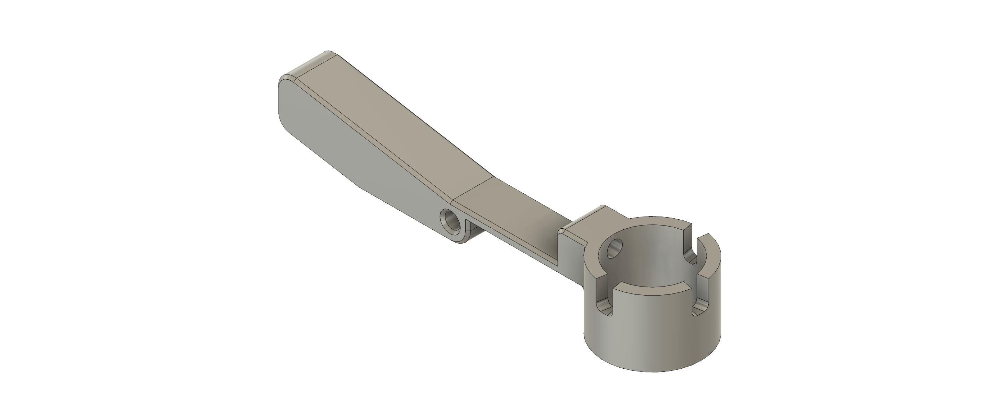 | PLA / PETG | Recutting the thread after printing recommended |
| 1 | `./print/stl/carriage_penholder_connector_screw.stl` 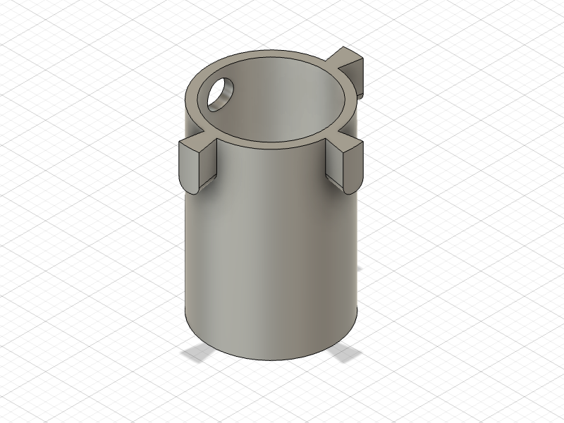 | PLA / PETG | |
| 1 | `./print/stl/carriage.stl` 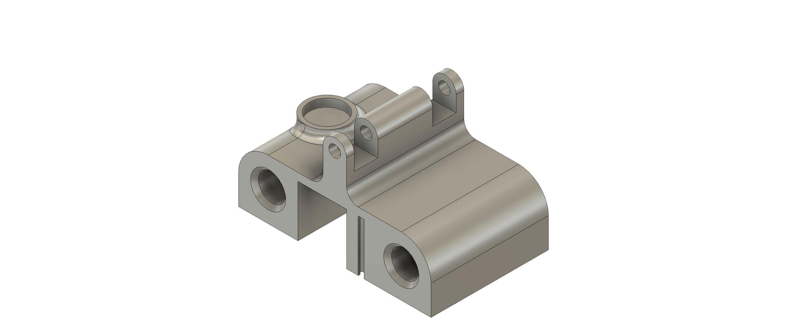 | PLA / PETG | |
| 2 | `./print/stl/flat_steel_flange.stl` 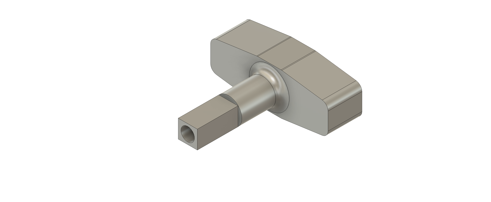 | PLA / PETG |  |
| 1 | `./print/stl/flat_steel_lever.stl` 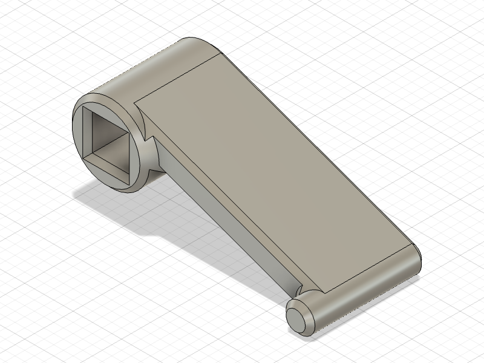 | PLA / PETG |  |
| 1 | `./print/stl/frame_back.stl` 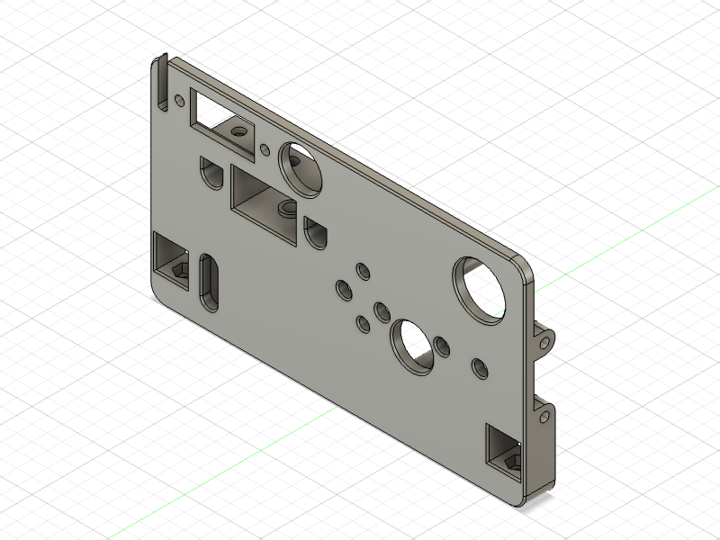 | PLA / PETG |  |
| 1 | `./print/stl/frame_front.stl` 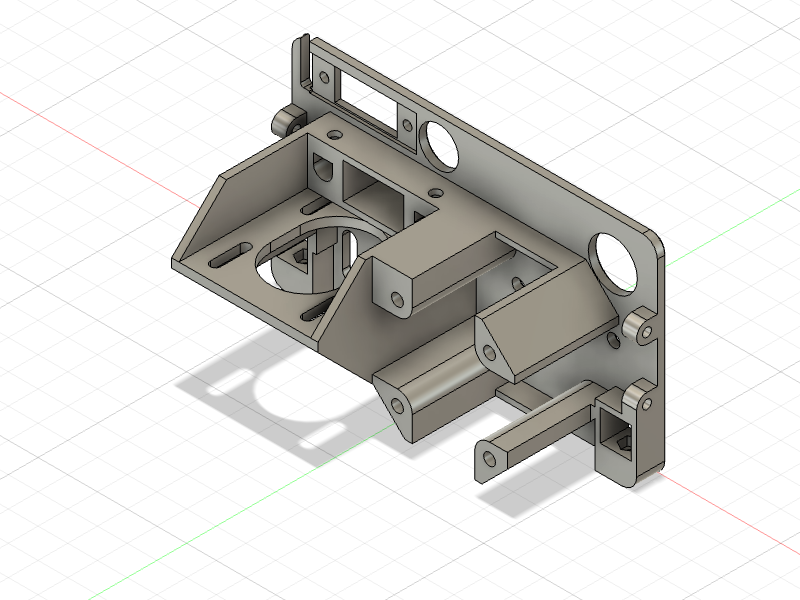 | PLA / PETG |  |
| optional | `./print/stl/housing_back.stl` 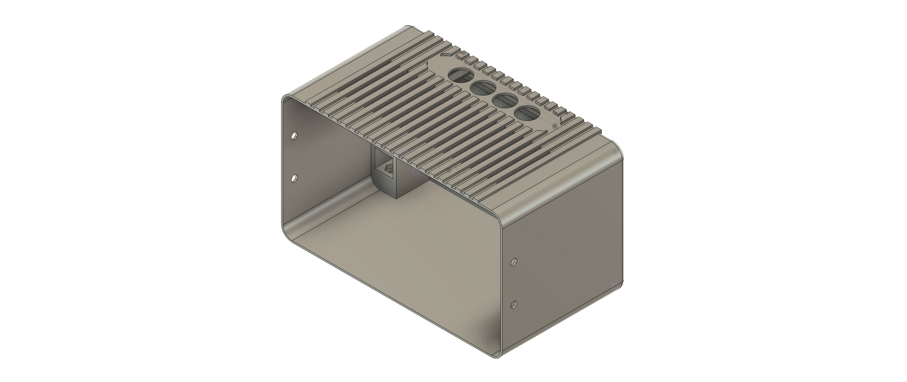 | PLA / PETG | In case a housing is required. |
| optional | `./print/stl/housing_front.stl` 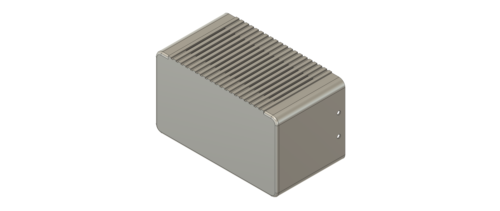 | PLA / PETG | In case a housing is required |
| optional: 4 | `./print/png/housing_feet.stl` 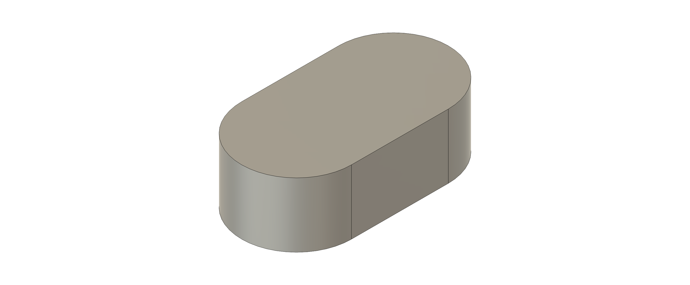 | TPU | Only required if housing is required and no standard rubber dampers are used instead, e.g. [AliExpress](https://de.aliexpress.com/item/1005008240903321.html) |
| 1 | `./print/stl/paper_guide_back.stl` 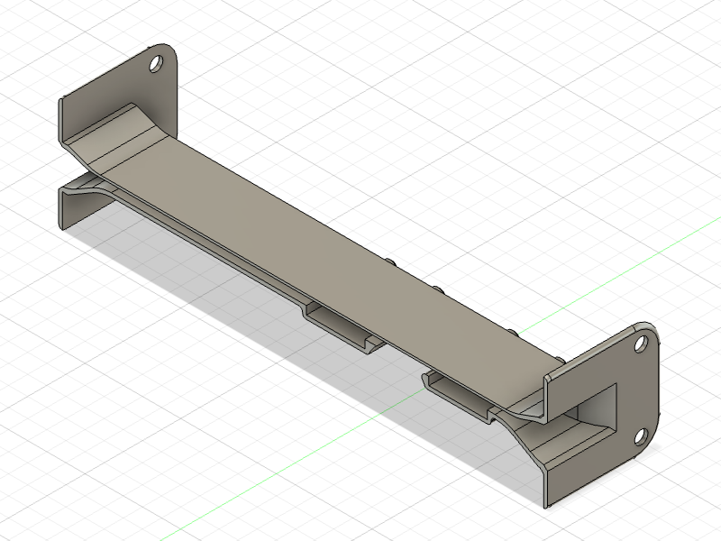 | PLA / PETG |  |
| 1 | `./print/stl/paper_guide_front.stl` 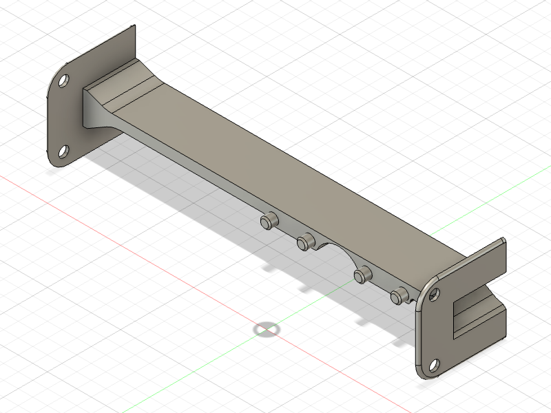 | PLA / PETG |  |
| 1 | `./print/stl/paper_bail_lever.stl` 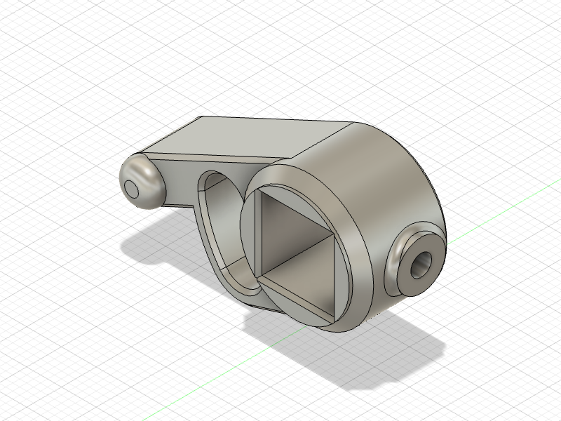 | PLA / PETG |  |
| 1 | `./print/stl/paper_bail_pusher_front.stl` 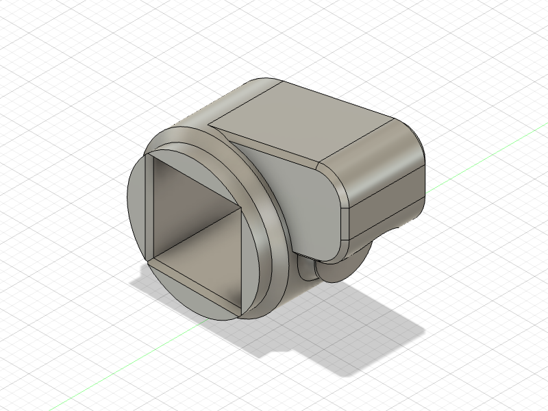 | PLA / PETG |  |
| 1 | `./print/stl/paper_bail_pusher_back.stl` 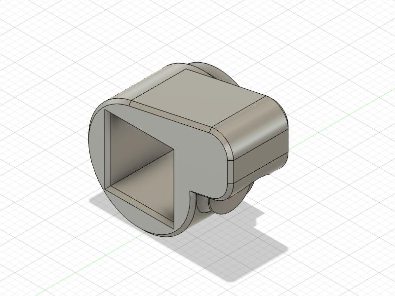 | PLA / PETG |  |
| 2 | `./print/stl/paper_bail_roll_fork.stl` 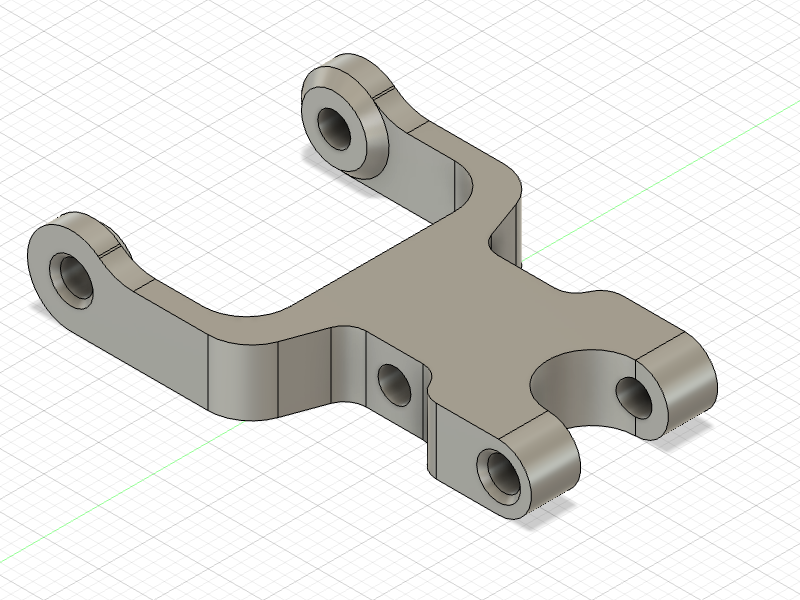 | PLA / PETG |  |
| 2 | `./print/stl/paper_bail_roll_holder.stl` 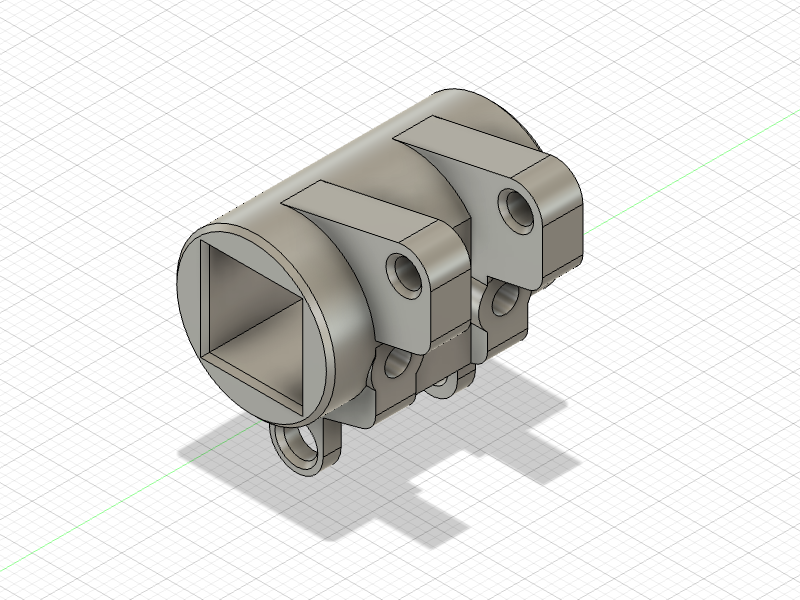 | PLA / PETG |  |
| optional | `./print/stl/shaft_connector_flange.stl` 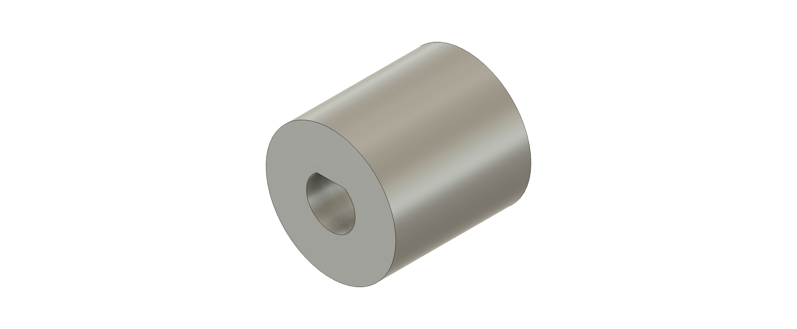 | PLA / PETG | Only required if standard couplers are not used. |
| 1 | `./print/stl/shaft_end_flange.stl` 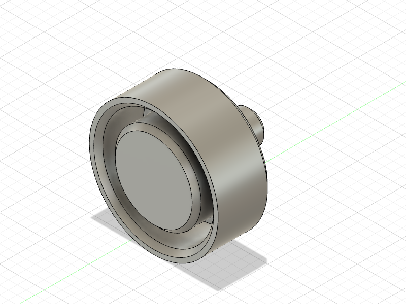 | PLA / PETG |  |
| 1 | `./print/stl/solenoid_slider.stl` 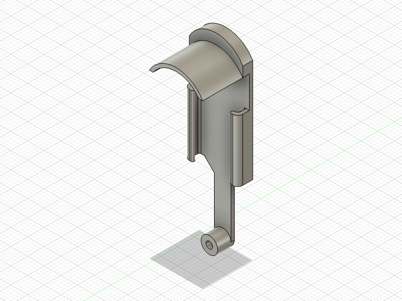 | PLA / PETG | If a pull solenoid is used. |
| optional | `./print/stl/cable_management.stl` 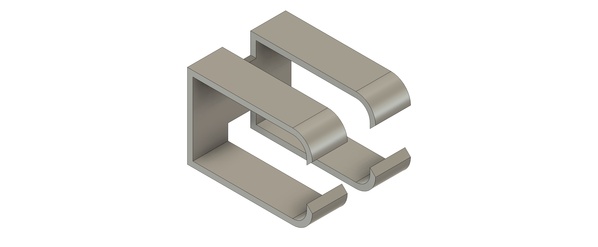 | PLA / PETG | Print as needed |

## Mechanical hardware 

| Quantity | Part | Notes |
| ------- | ---- | ----- |
| 1 | Pull Solenoid 12V TAU-0530 | [AliExpress](https://de.aliexpress.com/item/32748229525.html) |
| 2 | Stepper Motor NEMA 17 | Square body recommended, e.g. McMaster Carr Part No: 6627T64 |
| 3 | 12mm square rod aluminium/steel | Minimum length for A4: 250 mm without housing, 380 mm with housing. |
| 2 | 6mm round rod aluminium/steel | Minimum length for A4: 250 mm. |
| 3 | 12mm steel shaft | Minimum length for A4: 250 mm. |
| 2 | Linear ball Bearing (6mm ID, 12mm OD, 19mm length) | example McMaster Carr Part No: 3766n13 |
| optional: 1 | 5mm/12mm shaft diameter couplings | Alternatively use printed version |
| 7 | F624ZZ flanged bearings (4mm ID, 13mm OD) | example McMaster Carr Part No: 57155K563 |
| 1 | Compression spring, >=10 mm Long, 7-9 mm OD | McMaster Carr Part No: 94125K203 |
| 1 | Extension Spring with Loop Ends 30mm idle / >=50mm extended | example McMaster Carr Part No: 8464n179 |
| 2 | Extension Spring with Loop Ends 17mm idle / >=25mm extended | example McMaster Carr Part No: 5108N951 |
| optional: 4 | Rubber foam dampers | Optional; can also be 3D-printed. [AliExpress](https://de.aliexpress.com/item/1005008240903321.html) |
| 1 | 5mm 2GT Timing Belt Pulley | example McMaster Carr Part No: 3684N12 |
| 1 | 5mm 2GT Timing Belt | e.g. aliexpress.com/item/1005006322039198.html |
| 1 | 5mm 2GT Timing Belt Idler Pulley | example McMaster Carr Part No: 3693N11 | 

### Fasteners and small hardware

| Quantity | Part | Notes |
| ------- | ---- | ----- |
| 1 | M2 x 12 hex socket screw (DIN EN ISO 4762) | For solenoid pin |
| 1 | M2 x 0.4 hex nut (DIN 439-2) | For solenoid pin |
| 6 | M3 x 4 hex socket screws (DIN EN ISO 4762) | for optical endstops and solenoid |
| 36 | M3 x 6 hex socket screws (DIN EN ISO 4762) | general assembly unless otherwise specified |
| 4 | M3 x 20 hex socket screws (DIN EN ISO 4762) | For shaft stepper |
| 4 | M3 x 16 hex socket screws (DIN EN ISO 4762) | For tension springs in rollers |
| 12 | M3 x 0.6 hex nuts (DIN 439-2) | Press into into printed part to counter screws where indicated |
| 1 | M4 x 16 threaded pin (DIN EN ISO 4027) | For timing belt idler |

## Electronics (high-level)

| Quantity | Part | Notes |
| ------- | ---- | ----- |
| 1 | Arduino Uno |  |
| 1 | Arduino Uno CNC Shield incl. 2 Stepper Drivers (DRV8825, A4988, or similar) |  |
| 1 | DC power jack connector, 5.5 x 2.1mm | e.g. aliexpress.com/item/1005004979253130.html |
| 1 | 12V Power supply, 5.5 x 2.1mm | e.g. aliexpress.com/item/32874871456.html |
| 1 | TZT1 MOSFET Driver | drives solenoid, e.g. aliexpress.com/item/32803005422.html |
| 1 | 4 pushbutton module | aliexpress.com/item/1005007272677522.html |
| 2 | Optical endstop | e.g. aliexpress.com/item/1005006173344380.html |
