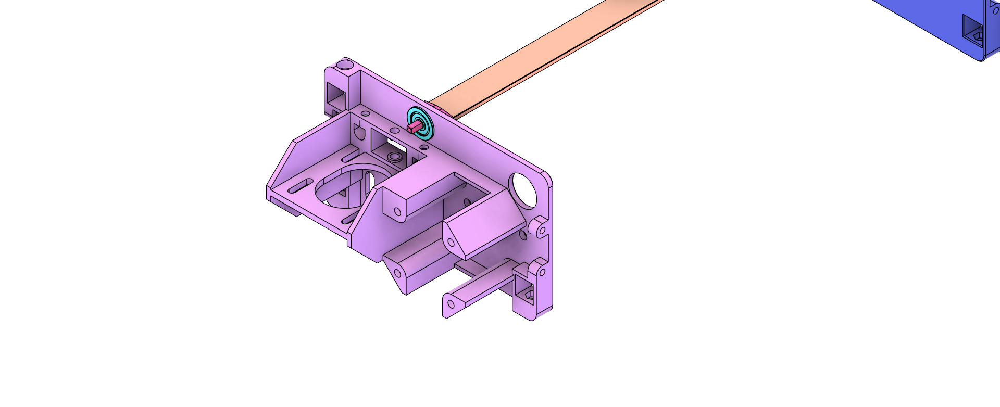
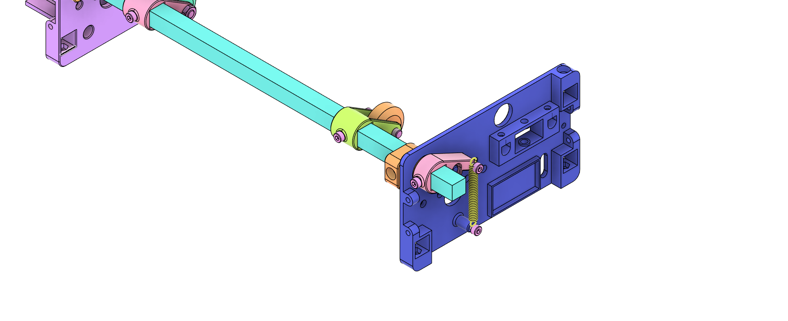
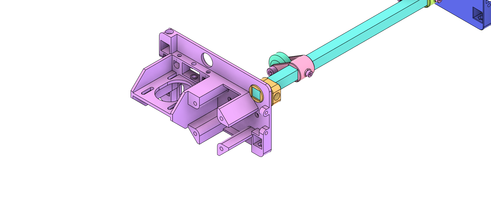
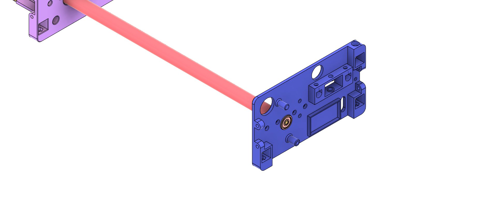
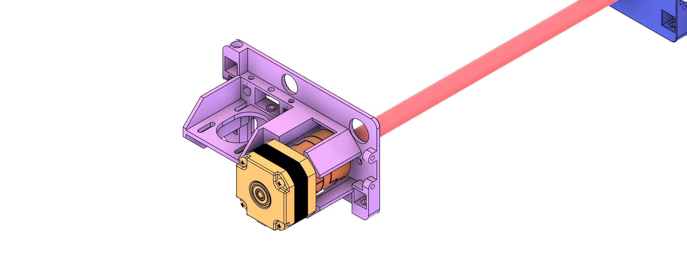
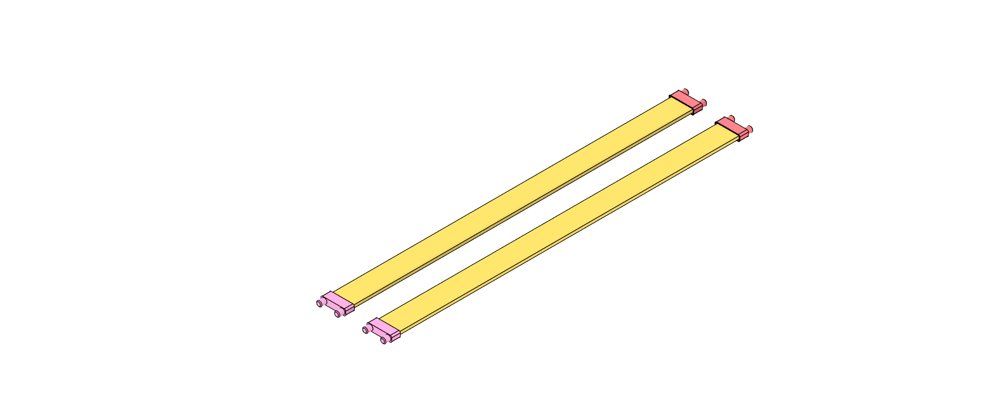

# G-code Pen Plotter

This plotter draws vector graphics in G-code format using a pen.

- Compatible with pens up to 11 mm in diameter
- Rigid frame construction.
- Uses affordable and widely available components.

# Table of Contents
- [Mechanics](#Mechanics)
- [Electronics](#Electronics)
- [Software](#Software)
- [Acknowledgements](#Acknowledgements)

## Mechanics

### 3D-Printed Parts

| Quantity | Part | Material | Notes |
| ------- | ---- | -------- | ----- |
| 1 | `./print/stl/carriage_penholder_base.stl`  | PLA / PETG | |
| 1 | `./print/stl/carriage_penholder_connector_fitting.stl`  | TPU | |
| 1 | `./print/stl/carriage_penholder_connector_head.stl`  | PLA / PETG | |
| 1 | `./print/stl/carriage_penholder_connector_screw.stl`  | PLA / PETG | |
| 1 | `./print/stl/carriage.stl`  | PLA / PETG | |
| 2 | `./print/stl/flat_steel_flange.stl`  | PLA / PETG |  |
| 1 | `./print/stl/flat_steel_lever.stl`  | PLA / PETG |  |
| 1 | `./print/stl/frame_back.stl`  | PLA / PETG |  |
| 1 | `./print/stl/frame_front.stl`  | PLA / PETG |  |
| 1 | `./print/stl/housing_back.stl`  | PLA / PETG | optional |
| 1 | `./print/stl/housing_front.stl`  | PLA / PETG | optional |
| 4 | `./print/png/housing_feet.stl`  | TPU | Standard rubber dampers can be used instead, e.g. https://de.aliexpress.com/item/1005008240903321.html |
| 1 | `./print/stl/paper_guide_1.stl`  | PLA / PETG | Requires light supports. |
| 1 | `./print/stl/paper_guide_2.stl`  | PLA / PETG | Requires light supports. |
| 1 | `./print/stl/paper_guide_lever.stl`  | PLA / PETG |  |
| 2 | `./print/stl/paper_guide_pusher.stl`  | PLA / PETG |  |
| 2 | `./print/stl/paper_guide_roll_holder.stl`  | PLA / PETG |  |
| 4 | `./print/stl/paper_intake_support.stl`  | PLA / PETG |  |
| 1 | `./print/stl/shaft_connector_flange.stl`  | PLA / PETG | Optional, if standard couplers are not used. |
| 1 | `./print/stl/shaft_end_flange.stl`  | PLA / PETG |  |
| 1 | `./print/stl/solenoid_slider.stl`  | PLA / PETG | If a pull solenoid is used. |

### Standard Parts
| Quantity | Part | Notes |
| ------- | ---- | ----- |
| 3 | 12mm square rod aluminium/steel | Minimum length for A4: 250 mm without housing, 380 mm with housing. |
| 2 | 6mm rounded aluminium/steel rod | Minimum length for A4: 250 mm. |
| 1 | 12mm shaft | Minimum length for A4: 250 mm. |
| 1 | Pull Solenoid 12V TAU-0530 | https://de.aliexpress.com/item/32748229525.html |
| 4 | brass oil bar plain bearing, 6mm bore, 8mm outer diameter |  |
| 4 | rubber foam dampers | Optional; can also be 3D-printed. https://de.aliexpress.com/item/1005008240903321.html |
| 1 | 5mm/12mm shaft diameter couplings |
| 3 | Stainless Steel Ball Bearing, Flanged | McMaster Part No: 57155K563 |
| 2 | Stepper Motor with Square Body, NEMA 17 | McMaster Part No: 6627T64 |
| 1 | Extension Spring with Loop Ends | McMaster Part No: 8464n179 |
| 1 | Timing Belt Pulley, 5mm width | McMaster Part No: 3684N12 |
| 1 | Timing Belt, 5mm width |
| 1 | Timing Belt Idler Pulley, 5mm width | McMaster Part No: 3693N11 | 
| 1 | hexagon socket screw, DIN EN ISO 4762 - M2 x 12 | For solenoid pin |
| 1 | hexagon nut, DIN 439-2 - M2 x 0.4 | For solenoid pin |
| 22 | hexagon socket screw, DIN EN ISO 4762 - M3 x 6 | Standard screw used unless otherwise specified |
| 4 | hexagon socket screw, DIN EN ISO 4762 - M3 x 30 | For shaft stepper |
| 10 | hexagon nut, DIN 439-2 - M3 x 0.6 | Insert into the front and back frame. |
| 1 | threaded pin, DIN EN ISO 4027 - M4 x 16 | For timing belt idler |
| 2 | hexagon socket screw, DIN EN ISO 4762 - M3 x 10 Stahl | For carriage. |
| 2 | hexagon nut, DIN 439-2 - M5 x 0.8 | For rollers. |
| 2 | hexagon socket screw, DIN EN ISO 4762 - M5 x 20 | For rollers. |
| 2 | V nut POM wheel roller | For rollers. |

### Assembly

The following steps illustrate the assembly process. The order is chosen for clarity and may not reflect the optimal assembly sequence.

Assemble the pen carriage, slide it over the rounded steel rods, and attach the timing pulley:

Overview of the base frame structure with supporting square rods:

Slide the flanges onto the flat steel, insert them into the flanged bearing pressed into the frame, and secure by attaching the lever to the square rod of the flange. Install the solenoid and attach the slider cap:

Assemble the paper guide by adding the rollers and lever, then insert it into the frame. Secure by screwing the lever to the back end and attaching the tension spring:

Assemble the shaft by attaching the coupler to the stepper, sliding in the steel shaft, and securing it with the end flange to the bearing on the opposite side of the frame:

Details of the paper intake support and its assembly to the frame, including the paper guide:

The completed assembly will look like this:

Optional: Glue the feet to the housing shells, slide them over the frame and rods, and secure with screws to the frame:  

## Electronics

Coming soon.

## Software

Coming soon.