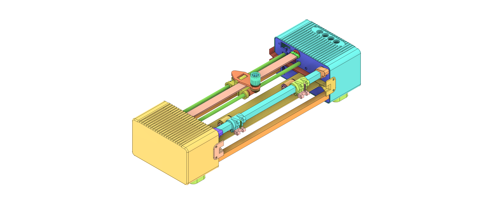
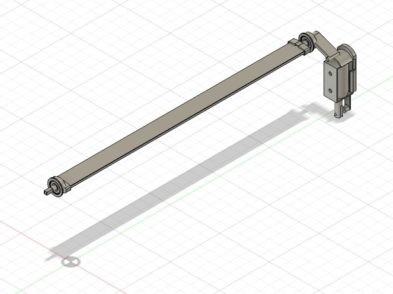
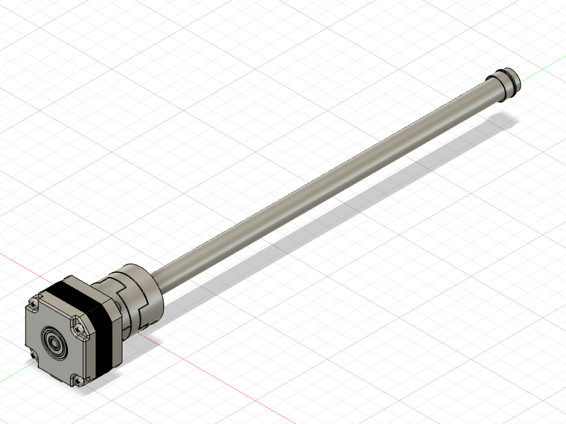
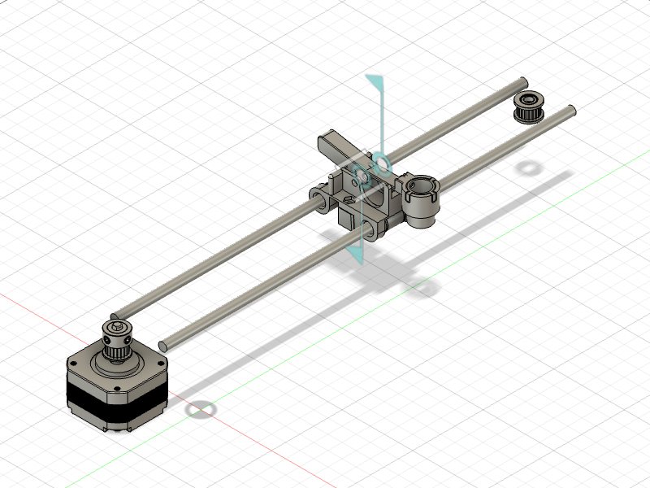
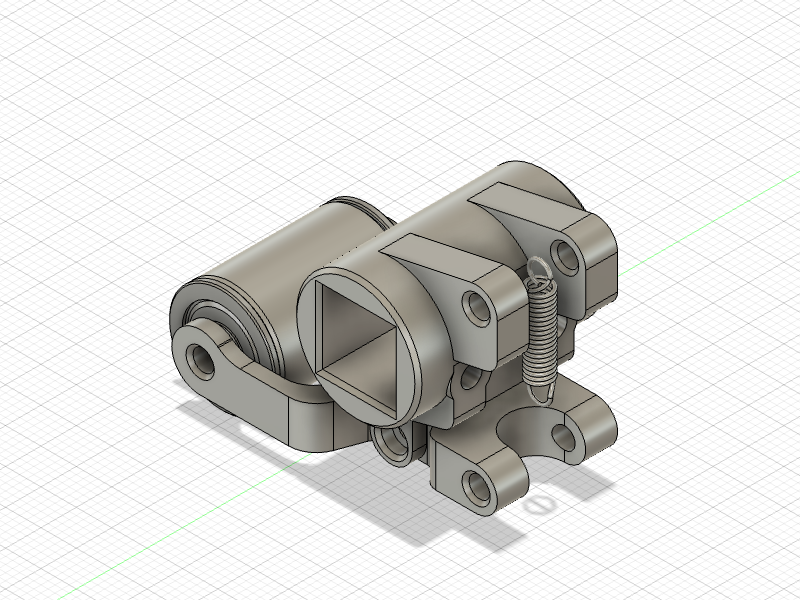
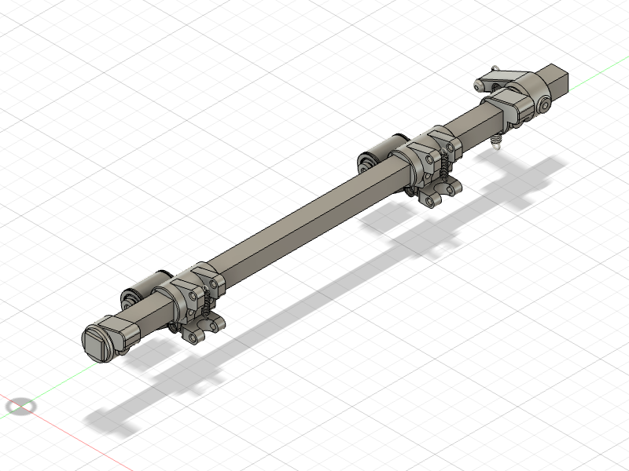

# G-code Pen Plotter

This plotter draws vector graphics in G-code format using a pen. It is compatible with pens up to 11 mm in diameter, relies on inexpensive and widely available components, and uses a mostly 3D-printed frame with a few off-the-shelf mechanical parts.

# Table of contents
- [Overview](#overview)
- [Features](#features)
- [Bill of Materials](#bill-of-materials)
- [Assembly](#assembly)
- [Electronics](#electronics)
- [Software](#software)
- [License and Acknowledgements](#license-and-acknowledgements)

## Overview

This pen plotter is meant for hobbyists and makers who want a low-cost machine to draw vector artwork on paper. It uses two stepper-driven axes, a simple pen carriage with a lift mechanism via solenoid for automated pen up/down control. Most structural parts are 3D-printed and a number of standard mechanical parts (rods, bearings, springs, belt and pulleys) complete the build.

## Features

- Compatible with pens up to 11 mm diameter
- Mostly 3D-printed components for easy reproduction
- Solenoid-based pen actuator
- Uses commonly available NEMA 17 stepper motors and standard bearings
- Designed for A4-sized paper by default (adjustable)

## Bill of Materials

Below are the main 3D-printed parts and standard hardware used in the project. See the [full BOM](BOM.md) and the `print/` directory for the source STL/PNG files and visual references.

### 3D-printed parts (selected)

Refer to the `print/stl/` and `print/png/` folders for all printable parts and preview images.

- `frame_front.stl`, `frame_back.stl` — frame halves
- `housing_front.stl`, `housing_back.stl`, `housing_feet.stl` — optional housing
- `carriage_penholder_base.stl`, `carriage_penholder_connector_screw.stl` — carriage and pen holder
- `flat_steel_flange.stl`, `flat_steel_lever.stl` — parts that interface with the steel pen-raising strip
- `paper_bail_*.stl` — paper bail and rollers
- `paper_guide_front.stl`, `paper_guide_back.stl` — paper gudie
- `shaft_end_flange.stl`, `shaft_connector_flange.stl` — shaft support parts
- `solenoid_slider.stl` — slider to make the pull solenoid a push solenoid (optional)
- `cable_management.stl` — optional cable management clips

### Standard hardware (selected)

- 12 mm square rods 
- 6 mm round rods 
- 12 mm steel shaft
- 2x 6mm linear ball bearings
- 2x NEMA 17 stepper motors
- 2GT 5mm timing belt, timing pulley and idler pulley
- Assorted M2/M3/M4 screws and nuts (details in original BOM)
- Bearings: F624ZZ bearings used in the rollers
- Springs: compression and extension springs as needed for pen lift and paper drive
- Pull solenoid 12 V (example: TAU-0530)

For a complete part list including quantities and McMaster/AliExpress references, see the original [BOM](BOM.md) in the repository.

## Assembly

The repository contains step-by-step photos and GIFs in `print/zsb/` that show how parts fit together. The high-level assembly steps are:

1. Prepare the back frame: press in M3 nuts, install bearings, fit the timing-belt pulley and mount the optical endstop and solenoid.

2. Prepare the front frame: press in M3 nuts, install bearings, attach stepper motor and shaft coupler, and mount the drive pulley and endstop.

3. Join both frame halves: insert the paper guide rods, shaft, and the movable flat-steel strip used for pen lifting.

Fully assembled lever mechanism:

Fully assembled drive shaft:

4. Slide the carriage onto the guide rods and secure the timing belt to the carriage. Fit the belt around the drive and idler pulleys and tension appropriately.

Fully assembled carriage and timing belt mechanism:

5. Assemble and install the paper bail rollers and springs that hold and move the paper.

Detail for each paper bail roller:

Fully assembled paper bail:

6. Optionally assemble and attach the housing halves for a finished enclosure.

Important: some assembly steps (press-fitting nuts and bearings, re-threading printed holes) may require light machining or careful rework for reliable operation.

## Electronics

Wiring and electronics are intentionally simple to keep the project accessible.

1. Route the stepper motor and endstop cables through the frame openings into the enclosure.
2. Secure cables with cable ties and cable management clips to avoid interference with moving parts.
3. The optional solenoid (if installed) mounts to the carriage or frame and is wired to a 12 V supply with a suitable MOSFET or driver circuit controlled by the microcontroller.
4. Prepare the PCB holder by pressing in the M3 nuts. Screw the Arduino to it. Add the CNC shield and the stepper drivers to the arduino. Finally slide PCB holder over the rods. 
5. Assemble all wires according to schematics below
6. Attach housing and fix it to PCB holder and to the rods by M3 screws. Make sure USB port and power jack is visible

TBD:
Detailed wiring diagrams 

## Software

The software stack for the plotter is not included in this README yet. Typical setups use firmware that accepts G-code (for example GRBL or a custom ESPHome/Marlin build) and a host program to convert vector graphics to G-code (Inkscape, custom scripts, or online tools).

Planned software documentation:

- Recommended firmware and pinouts
- Example G-code files and test patterns
- A short guide to convert SVG/vector graphics to G-code suitable for this plotter

If you have working firmware or scripts, contributions are welcome.

## Acknowledgements

Thanks to the open-source community and suppliers of affordable components. If you found or adapted any parts from other projects, please credit them in the repository history or in a CONTRIBUTORS file.

## Development

Contributions are welcome — see `CONTRIBUTING.md` for details.

All .stl, .png and assembly pictures are automatically exported via my Fusion add-in, see [here](https://github.com/smengerl/fusion-exporter)

## License

This project is licensed under the Beerware License — see `LICENSE.txt` for details.

## Authors

- Simon Gerlach <https://github.com/Smenger>

---

If something in this README is missing or unclear, please open an issue in the repository so the instructions can be improved.
