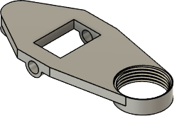
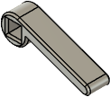
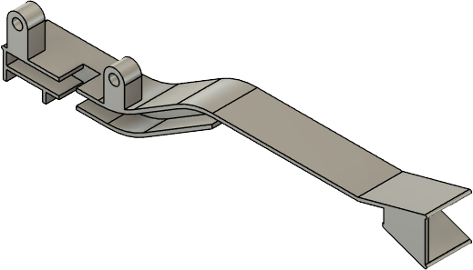
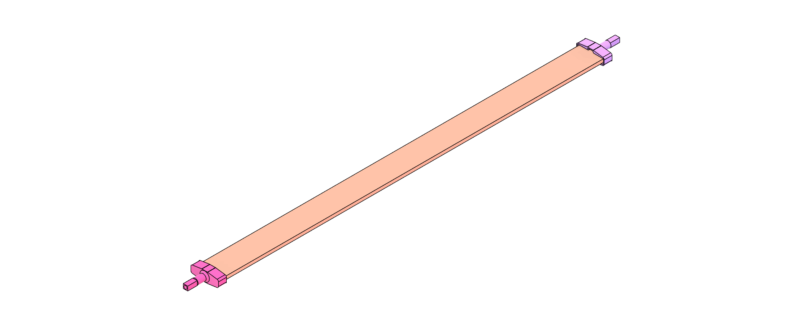
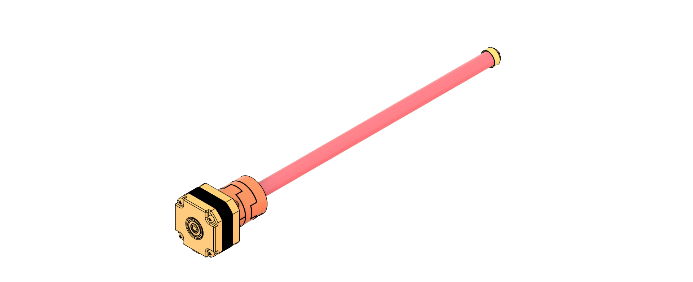

# gcode pen plotter

Plotter for drawing vector graphics in gcode format with a pen:

- Use any pin up to 11mm diameter
- rigid frame
- low cost components

# Index
- [Mechanics](#Mechanics)
- [Electronics](#Electronics)
- [Software](#Software)
- [Acknowledgements](#Acknowledgements)

## Mechanics

### 3D printed parts

| Quantity | Part | Material | Notes |
| -------- | ---- | -------- | ----- |
| 1 | `./print/stl/carriage_penholder_base.stl`  | PLA / PETG | |
| 1 | `./print/stl/carriage_penholder_connector_fitting.stl`  | TPU | |
| 1 | `./print/stl/carriage_penholder_connector_head.stl`  | PLA / PETG | |
| 1 | `./print/stl/carriage_penholder_connector_screw.stl`  | PLA / PETG | |
| 1 | `./print/stl/carriage.stl`  | PLA / PETG | |
| 2 | `./print/stl/flat_steel_flange.stl`  | PLA / PETG |  |
| 1 | `./print/stl/flat_steel_lever.stl`  | PLA / PETG |  |
| 1 | `./print/stl/frame_back.stl`  | PLA / PETG |  |
| 1 | `./print/stl/frame_front.stl`  | PLA / PETG |  |
| 1 | `./print/stl/housing_back.stl`  | PLA / PETG | optional |
| 1 | `./print/stl/housing_front.stl`  | PLA / PETG | optional |
| 4 | `./print/png/housing_feet.stl`  | TPU | Can use standard rubber dampers instead, e.g. https://de.aliexpress.com/item/1005008240903321.html |
| 1 | `./print/stl/paper_guide_1.stl`  | PLA / PETG | Use light supports |
| 1 | `./print/stl/paper_guide_2.stl`  | PLA / PETG | Use light supports |
| 1 | `./print/stl/paper_guide_lever.stl`  | PLA / PETG |  |
| 2 | `./print/stl/paper_guide_pusher.stl`  | PLA / PETG |  |
| 2 | `./print/stl/paper_guide_roll_holder.stl`  | PLA / PETG |  |
| 4 | `./print/stl/paper_intake_support.stl`  | PLA / PETG |  |
| 1 | `./print/stl/shaft_connector_flange.stl`  | PLA / PETG | optional, if no standard couplers are used |
| 1 | `./print/stl/shaft_end_flange.stl`  | PLA / PETG |  |
| 1 | `./print/stl/solenoid_slider.stl`  | PLA / PETG | If pull solenoid is used |

### Standard parts

| Quantity | Part | Note |
| -------- | ---- | ---- |
| 3 | 12mm square rod aluminium/steel | min length for A4: 250mm w/o housing, 380mm with housing |
| 2 | 6mm rounded aluminium/steel rod | min length for A4: 250mm |
| 1 | 12mm shaft | min length for A4: 250mm |
| 1 | Pull Solenoid 12V TAU-0530 | https://de.aliexpress.com/item/32748229525.html |
| 4 | brass oil bar plain bearing, 6mm bore, 8mm outer diameter |  |
| 4 | rubber foam dampers | optional, can also be printed. https://de.aliexpress.com/item/1005008240903321.html |
| 1 | 5mm/12mm shaft diameter couplings |
| 3 | Stainless Steel Ball Bearing, Flanged | McMaster Part No: 57155K563 |
| 2 | Stepper Motor with Square Body, NEMA 17 | McMaster Part No: 6627T64 |
| 1 | Extension Spring with Loop Ends | McMaster Part No: 8464n179 |
| 1 | Timing Belt Pulley, 5mm width | McMaster Part No: 3684N12 |
| 1 | Timing Belt, 5mm width |
| 1 | Timing Belt Idler Pulley, 5mm width | McMaster Part No: 3693N11 | 
| 1 | hexagon socket screw, DIN EN ISO 4762 - M2 x 12 | For solenoid pin |
| 1 | hexagon nut, DIN 439-2 - M2 x 0.4 | For solenoid pin |
| 22 | hexagon socket screw, DIN EN ISO 4762 - M3 x 6 | Standard screw used unless otherwise specified |
| 4 | hexagon socket screw, DIN EN ISO 4762 - M3 x 30 | For shaft stepper |
| 10 | hexagon nut, DIN 439-2 - M3 x 0.6 | Insert in front and back frame |
| 1 | threaded pin, DIN EN ISO 4027 - M4 x 16 | For timing belt idler |
| 2 | hexagon socket screw, DIN EN ISO 4762 - M3 x 10 Stahl | For Carriage |
| 2 | hexagon nut, DIN 439-2 - M5 x 0.8 | For Rollers |
| 2 | hexagon socket screw, DIN EN ISO 4762 - M5 x 20 | For Rollers |
| 2 | V nut POM wheel roller | Rollers |

### Assembly

Overview of base frame without supporting square rods:

Details paper guide and assembly to back of frame:

Details flat steel lever:

Assemble shaft by screwing coupler to stepper, slide in steel shaft and fix with end flange to bearing on opposite frame:

Assemble pen carriage, slide over rounded steel rods and fix timing pulley:

Full assembly:

Optional: glue feets to housing shells, slide them over the frame and rods and fix with screws to frame:  

## Electronics

Coming soon

## Software

Coming soon