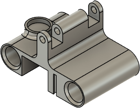
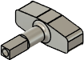
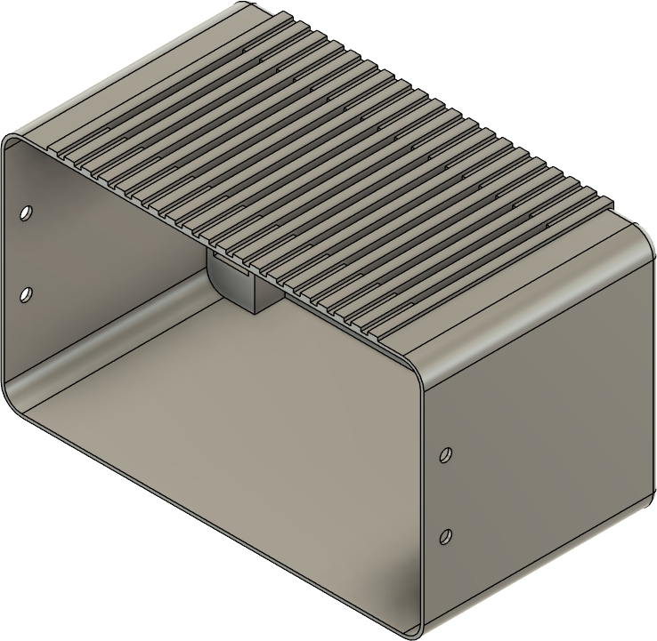
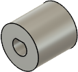
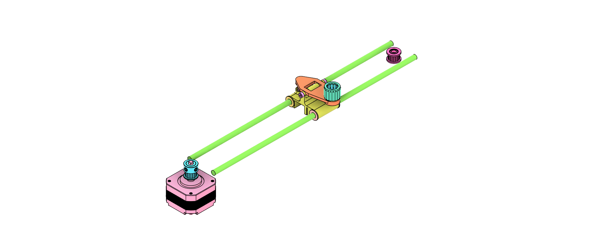
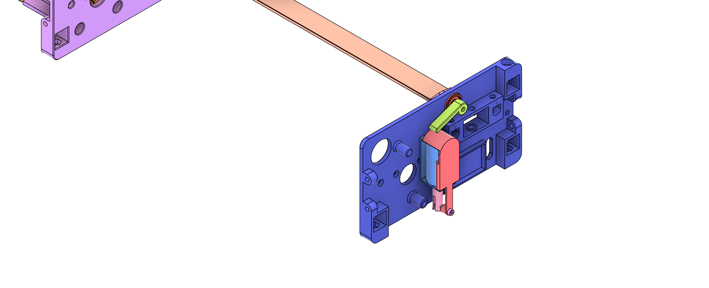
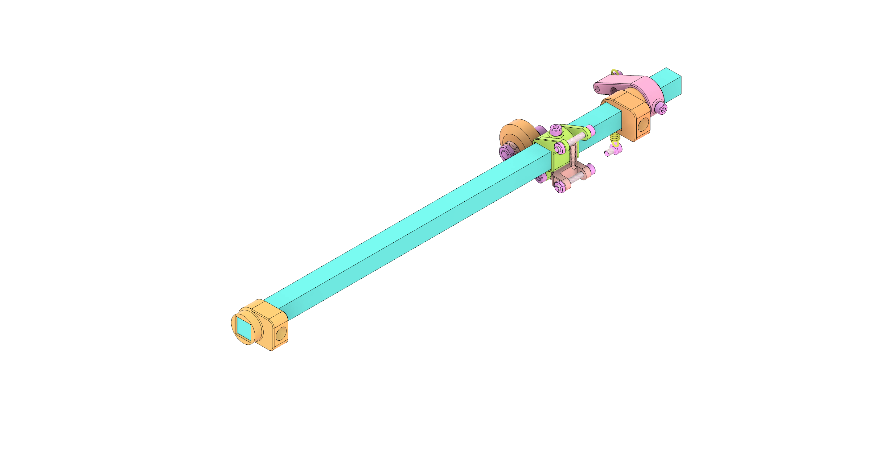
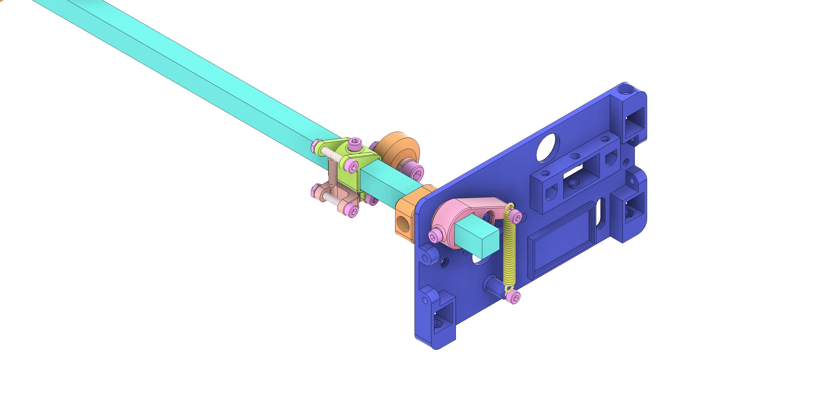
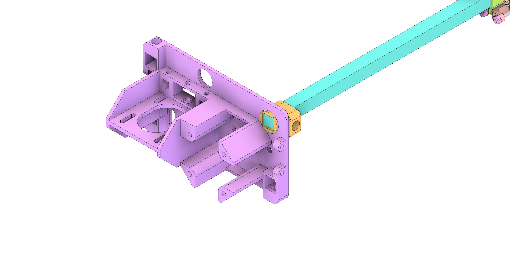
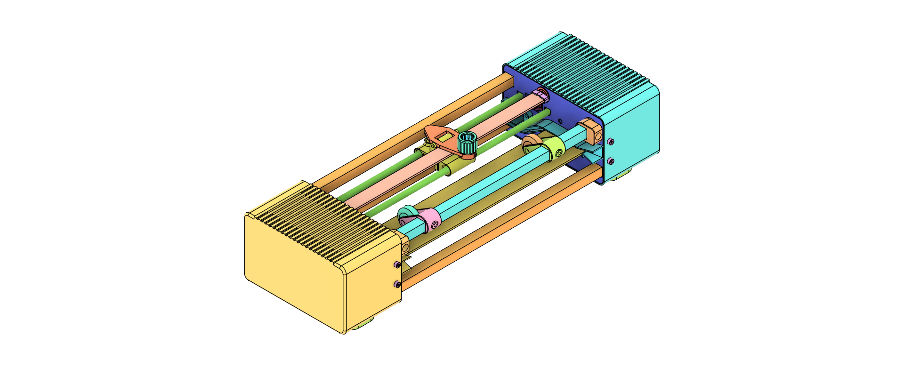

# G-code Pen Plotter

This plotter draws vector graphics in G-code format using a pen. It is compatible with pens up to 11 mm in diameter, features a rigid frame construction, and uses affordable, widely available components.

# Table of Contents
- [Mechanics](#Mechanics)
- [Electronics](#Electronics)
- [Software](#Software)
- [Acknowledgements](#Acknowledgements)

## Mechanics

### 3D-Printed Parts

| Quantity | Part | Material | Notes |
| ------- | ---- | -------- | ----- |
| 1 | `./print/stl/carriage_penholder_base.stl`  | PLA / PETG | Recutting the thread after printing recommended |
| 1 | `./print/stl/carriage_penholder_connector_fitting.stl`  | TPU | |
| 1 | `./print/stl/carriage_penholder_connector_head.stl`  | PLA / PETG | Recutting the thread after printing recommended |
| 1 | `./print/stl/carriage_penholder_connector_screw.stl`  | PLA / PETG | |
| 1 | `./print/stl/carriage.stl`  | PLA / PETG | |
| 2 | `./print/stl/flat_steel_flange.stl`  | PLA / PETG |  |
| 1 | `./print/stl/flat_steel_lever.stl`  | PLA / PETG |  |
| 1 | `./print/stl/frame_back.stl`  | PLA / PETG |  |
| 1 | `./print/stl/frame_front.stl`  | PLA / PETG |  |
| optional | `./print/stl/housing_back.stl`  | PLA / PETG | In case a housing is required. |
| optional | `./print/stl/housing_front.stl`  | PLA / PETG | In case a housing is required |
| optional: 4 | `./print/png/housing_feet.stl`  | TPU | Only required if housing is required and no standard rubber dampers are used instead, e.g. [AliExpress](https://de.aliexpress.com/item/1005008240903321.html) |
| 1 | `./print/stl/paper_guide_1.stl`  | PLA / PETG | Requires light supports when printing. |
| 1 | `./print/stl/paper_guide_2.stl`  | PLA / PETG | Requires light supports when printing. |
| 1 | `./print/stl/paper_guide_lever.stl`  | PLA / PETG |  |
| 2 | `./print/stl/paper_guide_pusher.stl`  | PLA / PETG |  |
| 2 | `./print/stl/paper_guide_roll_holder.stl`  | PLA / PETG |  |
| 4 | `./print/stl/paper_intake_support.stl`  | PLA / PETG |  |
| optional | `./print/stl/shaft_connector_flange.stl`  | PLA / PETG | Only required if standard couplers are not used. |
| 1 | `./print/stl/shaft_end_flange.stl`  | PLA / PETG |  |
| 1 | `./print/stl/solenoid_slider.stl`  | PLA / PETG | If a pull solenoid is used. |

### Standard Parts
| Quantity | Part | Notes |
| ------- | ---- | ----- |
| 3 | 12mm square rod aluminium/steel | Minimum length for A4: 250 mm without housing, 380 mm with housing. |
| 2 | 6mm rounded aluminium/steel rod | Minimum length for A4: 250 mm. |
| 1 | 12mm shaft | Minimum length for A4: 250 mm. |
| 1 | Pull Solenoid 12V TAU-0530 | [AliExpress](https://de.aliexpress.com/item/32748229525.html) |
| optional: 4 | Rubber foam dampers | Optional; can also be 3D-printed. [AliExpress](https://de.aliexpress.com/item/1005008240903321.html) |
| 4 | Flanged Sleeve Bearing| McMaster Carr Part No: 6659K216 |
| 1 | Compression spring, >=10 mm Long, 7-9 mm OD | McMaster Carr Part No: 94125K203 |
| 1 | 5mm/12mm shaft diameter couplings |
| 3 | Stainless Steel Ball Bearing, F624ZZ | Flanged, 4mm ID, 13mm OD, McMaster Carr Part No: 57155K563 |
| 2 | Stepper Motor with Square Body, NEMA 17 | McMaster Carr Part No: 6627T64 |
| 1 | Extension Spring with Loop Ends | McMaster Carr Part No: 8464n179 |
| 1 | Timing Belt Pulley, 5mm width | McMaster Carr Part No: 3684N12 |
| 1 | Timing Belt, 5mm width |
| 1 | Timing Belt Idler Pulley, 5mm width | McMaster Carr Part No: 3693N11 | 
| 1 | hexagon socket screw, DIN EN ISO 4762 - M2 x 12 | For solenoid pin |
| 1 | hexagon nut, DIN 439-2 - M2 x 0.4 | For solenoid pin |
| 26 | hexagon socket screw, DIN EN ISO 4762 - M3 x 6 | Standard screw used unless otherwise specified |
| 4 | hexagon socket screw, DIN EN ISO 4762 - M3 x 30 | For shaft stepper |
| 10 | hexagon nut, DIN 439-2 - M3 x 0.6 | Insert into the front and back frame. |
| 1 | threaded pin, DIN EN ISO 4027 - M4 x 16 | For timing belt idler |
| 2 | hexagon socket screw, DIN EN ISO 4762 - M3 x 10 | For carriage. |
| 2 | hexagon nut, DIN 439-2 - M5 x 0.8 | For rollers. |
| 2 | hexagon socket screw, DIN EN ISO 4762 - M5 x 20 | For rollers. |
| 2 | V nut POM wheel roller | For rollers. |

### Assembly

The following steps illustrate the assembly process. The order is chosen for clarity and may not reflect the optimal assembly sequence.

#### Carriage

Assemble the pen carriage by screwing the top part via M3 x 10 mm screws to the base. Snap-in the compression spring between base and top part. Insert the printed connector screw into the top part, add the TPU fitting, and secure it with the head. Press in the bearings and slide the carriage over the rounded steel rods.
Wrap the timing belt around the pulley attached to the stepper and the idler on the opposite side of the frame. Secure the idler with the threaded pin.
Cut the timing belt to length and press it into the belt clamp on the underside of the carriage:

Fully assembled carriage:

Carriage on rods with timing pulley assembly

Overview of the base frame structure with supporting square rods:

#### Flat steel pen raiser

Slide the flanges onto the flat steel, insert them into the flanged bearing pressed into the frame, and secure by attaching the lever to the square rod of the flange. Install the solenoid and attach the slider cap:

#### Paper guide

Assemble the paper intake support flat steel bars by pressing in the fittings on both ends and press them into front and back frame:

Add the paper guides to both sides of the frame by clicking them on the paper intake supports and the square rods. Optionally fix them to the frame by M3 x 10 screws. If you want to use optical end stops, fix them via these screws.

Assemble the paper guide by adding the rollers and lever, then insert it into the frame. Secure by screwing the lever to the back end and attaching the tension spring.
Finally fix all parts in their final position by M3 x 10 screws.

Detail of the front and back frame with the assembled paper intake support and paper guide:

#### Paper drive

Assemble the shaft by attaching the coupler to the stepper, sliding in the steel shaft, and securing it with the end flange to the bearing on the opposite side of the frame:

#### Final assembly and case

The completed assembly will look like this:

Optional: Glue the feet to the housing shells, slide them over the frame and rods, and secure with screws to the frame:  

## Electronics

Detailed instructions for electronics setup will be provided in future updates.

## Software

Detailed instructions for software setup will be provided in future updates.
